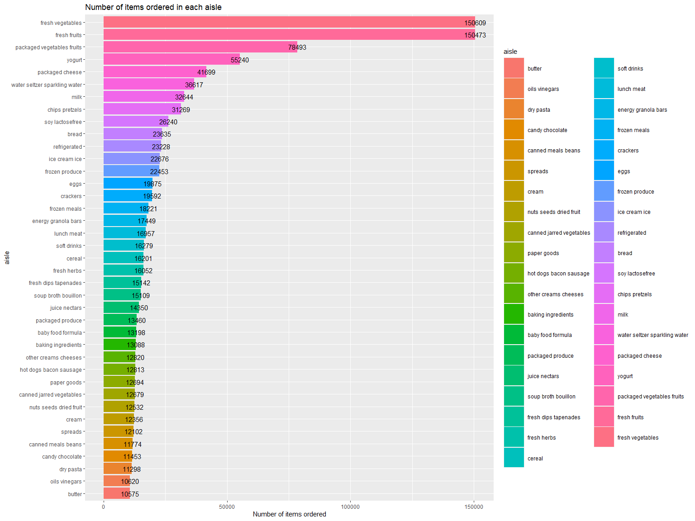

P8105_HW3_cc4778
================
Chee Kay Cheong

# Problem 1

The `instacart` dataset contains 15 variables and 1384617 observations,
where each row in the dataset is a product from an order. There is a
single order per user, and there are 131209 unique users in this
dataset.

### Questions

1.  How many aisles are there, and which aisles are the most items
    ordered from?

``` r
instacart %>% 
  select(aisle_id, aisle) %>% 
  distinct() 
```

    ## # A tibble: 134 × 2
    ##    aisle_id aisle                        
    ##       <int> <chr>                        
    ##  1      120 yogurt                       
    ##  2      108 other creams cheeses         
    ##  3       83 fresh vegetables             
    ##  4       95 canned meat seafood          
    ##  5       24 fresh fruits                 
    ##  6       21 packaged cheese              
    ##  7        2 specialty cheeses            
    ##  8      115 water seltzer sparkling water
    ##  9       53 cream                        
    ## 10      123 packaged vegetables fruits   
    ## # … with 124 more rows

``` r
# There are 134 distinct aisles.
instacart %>% 
  group_by(aisle) %>% 
  summarize(
    n_order = n()) %>% 
  arrange(desc(n_order))
```

    ## # A tibble: 134 × 2
    ##    aisle                         n_order
    ##    <chr>                           <int>
    ##  1 fresh vegetables               150609
    ##  2 fresh fruits                   150473
    ##  3 packaged vegetables fruits      78493
    ##  4 yogurt                          55240
    ##  5 packaged cheese                 41699
    ##  6 water seltzer sparkling water   36617
    ##  7 milk                            32644
    ##  8 chips pretzels                  31269
    ##  9 soy lactosefree                 26240
    ## 10 bread                           23635
    ## # … with 124 more rows

``` r
# Most items are ordered from the "Fresh vegetables" aisle.
```

2.  Make a plot that shows the number of items ordered in each aisle,
    limiting this to aisles with more than 10000 items ordered. Arrange
    aisles sensibly, and organize your plot so others can read it.

``` r
instacart %>% 
  group_by(aisle) %>% 
  summarize(
    n_order = n()) %>% 
  filter(n_order > 10000) %>% 
  ggplot(aes(x = aisle, y = n_order, fill = aisle)) +
  geom_bar(stat = "identity") +
  coord_flip() +
  geom_text(aes(label = n_order),
            position = position_stack(vjust = 1)) +
  labs(
    title = "Number of items ordered in each aisle",
    y = "Number of items ordered") +
  theme(legend.key.size = unit(1.2, 'cm'))
```

<!-- -->

3.  Make a table showing the three most popular items in each of the
    aisles “baking ingredients”, “dog food care”, and “packaged
    vegetables fruits”. Include the number of times each item is ordered
    in your table.
